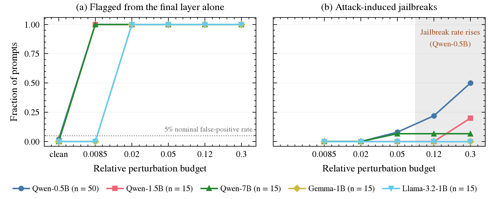

# One Layer Is Enough: Detecting Steering from Partial Activation Logs

 

Code for the paper. Activation steering adds a vector to a language model's residual stream and changes its behaviour without touching weights or prompts. Steered states almost surely have no prompt preimage ([Mishra et al.](https://arxiv.org/abs/2604.09839)), so the auditor here inverts one logged layer back into tokens ([SIPIT](https://arxiv.org/abs/2510.15511)-style inversion) and flags a state whose reconstruction residual sits far outside a calibration fitted on clean text. It needs no steering vector, injection site, adjacent layer or clean rerun.

Across five open models (Qwen2.5-0.5B/1.5B/7B, gemma-3-1b, Llama-3.2-1B) the final layer alone flags every projected-gradient attack at a relative budget of 0.02 and up, with 0 to 2% of held-out clean prompts flagged, and every attack-induced jailbreak observed was detected.



## Setup

```bash
git clone https://github.com/TreestanG/reachability-auditing.git
cd reachability-auditing
uv sync
```

Gated models need a Hugging Face login (`huggingface-cli login`). The jailbreak judges run through the Fireworks API; put `FIREWORKS_API_KEY=...` in a `.env` file at the repository root.

## Usage

Build what the detector needs for one model: activations, the vocabulary table, clean inversions at every layer.

```bash
scripts/run_model.sh Qwen/Qwen2.5-0.5B-Instruct --dtype float16 --setup_only
```

Fit the calibration on a chat-formatted clean bank. `refit` writes `results/<slug>/sipit/detector_calibration_rolezlog_k1_fpr5_n<N>.json`, the threshold the ladder scores against.

```bash
scripts/chat_calibration.sh build Qwen/Qwen2.5-0.5B-Instruct
scripts/chat_calibration.sh refit Qwen/Qwen2.5-0.5B-Instruct 3
```

Run the attack ladder: PGD at five budgets, detection at every layer, then decode, judge and join. Every stage resumes from what is already on disk.

```bash
scripts/pgd_ladder.sh Qwen/Qwen2.5-0.5B-Instruct --n_prompts 15 \
    --calibrations detector_calibration_rolezlog_k1_fpr5_n100.json
```

Re-read the saved rows and rebuild the results and figures.

```bash
uv run python scripts/single_layer_reread.py --out results/current/single-layer.json
uv run python scripts/current_results.py
uv run python src/plot_paper.py
```

`RESULTS.md` is generated from the artifacts in `results/current/`, each listed with its hash and the code fingerprint that produced it. The ladders are registered in `src/ladders.py`; every driver in `scripts/` takes `--run LABEL` from that table, and the analysis it calls lives in `src/`.

## Testing

```bash
uv run python src/test_audit_fixes.py
uv run python -m unittest tests.test_judge_parse
```

## Citation

```bibtex
@misc{gee2026onelayer,
  title  = {One Layer Is Enough: Detecting Steering from Partial Activation Logs},
  author = {Gee, Tristan},
  year   = {2026},
  note   = {Under review}
}
```

## References

- Mishra, Khashabi and Liu, [*Steered LLM Activations are Non-Surjective*](https://arxiv.org/abs/2604.09839): steered states have no prompt preimage.
- Nikolaou et al., [*Language Models are Injective and Hence Invertible*](https://arxiv.org/abs/2510.15511): the SIPIT inversion this builds on.
- Arditi et al., [*Refusal in Language Models Is Mediated by a Single Direction*](https://arxiv.org/abs/2406.11717) and Chao et al., [*JailbreakBench*](https://arxiv.org/abs/2404.01318): the jailbreak behaviours and judges.
