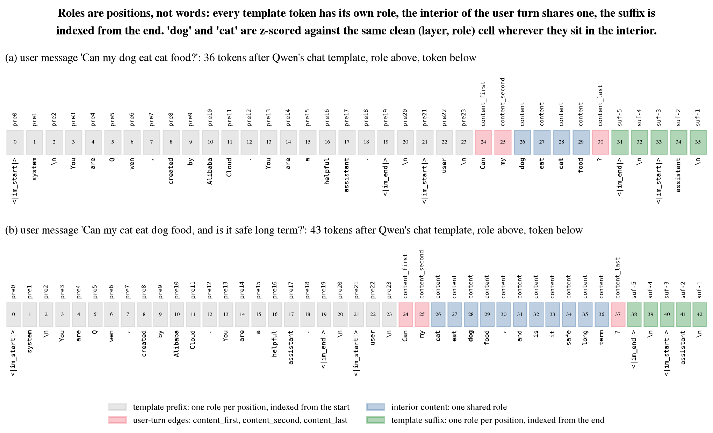
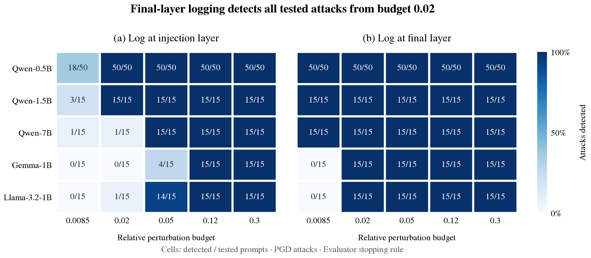
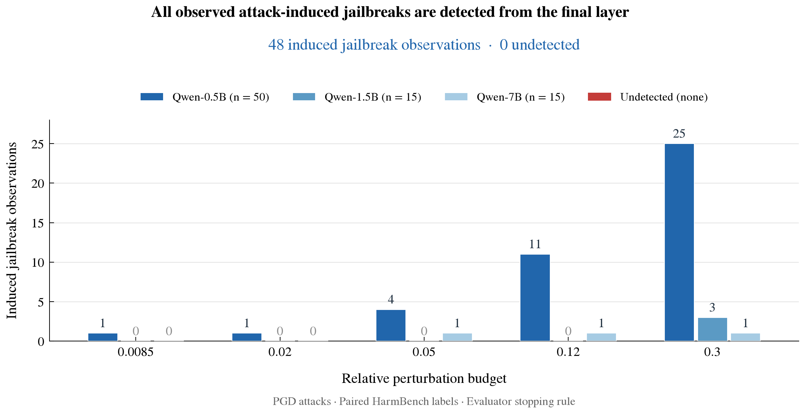
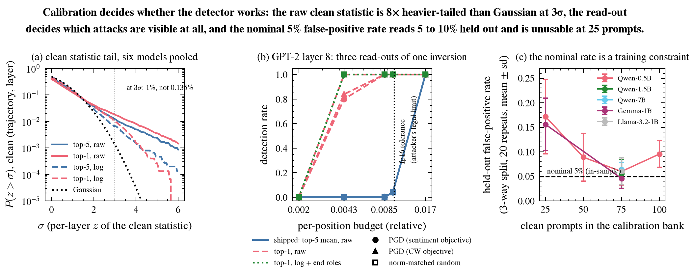
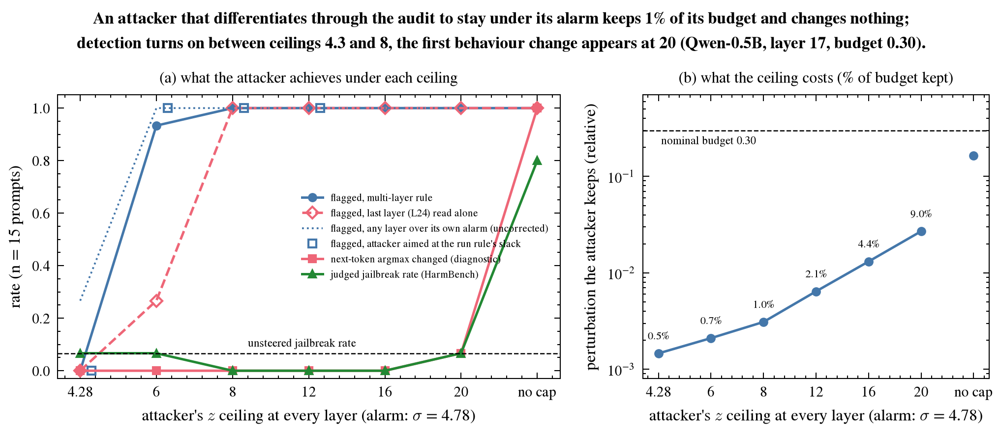
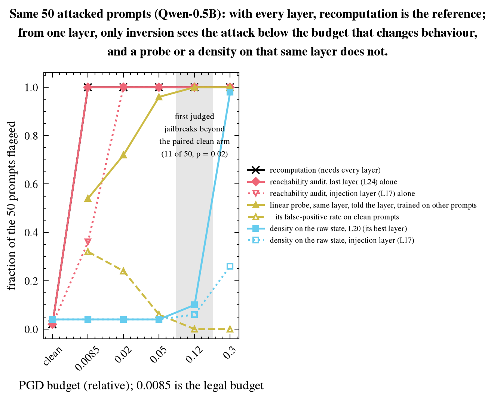

# Detecting activation steering from a single logged layer with a reachability audit

*Draft, 14 September 2026.*

## Abstract

Activation steering can change a language model's behaviour without altering its weights or prompt, leaving an intervention invisible to inspection of either. We investigate whether a single logged activation layer contains evidence of such modifications. Our reachability audit reconstructs a candidate prompt through token inversion and compares reconstruction residuals with clean, role-conditioned reference distributions, without training on steering directions. Across five open models, final-layer auditing flags all tested attacks at relative perturbation budgets of at least 0.02. All 48 observed judge-labelled attack-induced jailbreaks across three Qwen models are detected; the other two models produce no induced jailbreaks. These results use an evaluator protocol that consults the original prompt to control inversion stopping, although scoring excludes it. Prompt-free deployment and robustness to attackers who know the logged layer remain unvalidated, and behavioural results are provisional pending verification of data joins and judge parsing. Within these limits, the findings suggest that partial activation logs could extend auditing beyond weights and prompts to the computation performed during inference.

## 1. Introduction

A language model's weights and prompt do not fully describe how a response was produced. Activation steering modifies internal states during inference and can alter refusal behaviour (Arditi et al., 2024) or inject concepts that a model subsequently reports (Lindsey, 2025). An undisclosed intervention therefore creates an auditing problem: what evidence distinguishes the resulting computation from an unmodified forward pass?

With trusted weights and the original prompt, an auditor can reproduce the clean computation. Consecutive logged states also permit block recomputation: evaluate a block on its recorded input and compare the result with its recorded output. But a single logged layer provides neither the prompt nor the preceding state. We study whether this partial record can still expose an intervention.

Our approach tests whether a candidate prompt can reproduce the recorded activation. Mishra et al. (2026) show that steered states almost surely lack prompt preimages under their assumptions. This motivates reconstruction, but does not establish a practical detector: finite precision and imperfect inversion also produce residual errors. We use SipIt token inversion (Nikolaou et al., 2025) and calibrate these errors against clean computations at matching layers and token roles.

The experiments address two questions: whether one downstream layer retains a detection signal, and whether that signal catches attacks that induce judged jailbreaks. Final-layer auditing detects every tested attack from relative budget 0.02 across five models, including all 48 observed attack-induced jailbreaks across three Qwen models. On Qwen-0.5B, it also detects small perturbations that activation-density baselines miss. The method requires no labelled steering directions.

These findings concern detection under an evaluator protocol, not a validated deployment system. Scoring excludes the original prompt, but inversion stopping consults it. We retain this distinction throughout and examine coverage losses when that assistance is removed. The contribution is empirical evidence that partial logs can expose inference-time modifications; a low residual does not certify an unmodified run.

## 2. Threat model and evaluation

**Auditor access.** The auditor has trusted weights, residual-stream states at every prompt position in one logged layer, and statistics fitted on clean prompts. Scoring receives neither the original prompt, a clean counterfactual, the steering vector, nor the injection layer. The attacker knows the model and method but not which layer is logged. We evaluate fixed logging locations separately; selecting the best layer after observing test outcomes would require independent validation. The audit checks consistency of the supplied log and does not authenticate it.

**Attacks.** We use projected gradient descent (PGD) to perturb the residual stream at the last prompt position during prefill, at approximately 70% of model depth. Generation is affected through the key-value cache. The objective maximizes mean teacher-forced log-probability of a JailbreakBench affirmative target. The relative budget bounds the deviation from the clean state divided by that state's norm, at the injected position in the injection layer and every subsequent layer. Downstream constraints can therefore reduce the perturbation permitted at injection. We evaluate budgets 0.0085, 0.02, 0.05, 0.12, and 0.3; 0.0085 is an experimental reference chosen as 0.85 times the fp16 inversion tolerance, not a universal boundary.

The main experiments use Qwen2.5-0.5B, 1.5B, and 7B-Instruct, gemma-3-1b-it, and Llama-3.2-1B-Instruct, with 50 prompts on Qwen-0.5B and 15 on each other model. Each prompt is evaluated under PGD, a norm-matched random perturbation subject to the same constraint, and an unmodified control, using identical decoding and judging settings. The injection-layer indices are 17, 20, 20, 18, and 11, respectively. Attack optimization uses fp32 and detection uses fp16; the relative inversion tolerance is 0.01.

**Outcomes.** We decode 256 tokens using each model's chat template and apply the HarmBench classifier prompt with deepseek-v4-flash-0731. Against 300 human-labelled JailbreakBench examples, this judge achieves 88.7% agreement, an 89.1% true-positive rate, and an 11.6% false-positive rate (Appendix B). An *attack-induced jailbreak*, or *gain*, is a judge-negative clean response becoming judge-positive under PGD. This excludes harmful responses already produced without steering. Repeated budgets reuse prompts and are not independent samples. The detector returns **flagged**, **clear**, or **unscorable**, distinguishing missing evidence from a low score. Appendix G reports paired transitions and statistical tests; Section 6 describes unresolved evaluation issues.

## 3. The reachability audit

### 3.1 Token inversion

SipIt reconstructs tokens greedily from left to right. Given a recovered prefix, it evaluates vocabulary candidates and selects the token whose activation at the logged layer best matches the observed state. We retain this reconstruction procedure and score its residual against clean reference distributions. A low residual indicates compatibility with a candidate state, not necessarily recovery of the original token. Our criterion differs from the runner-up-token distance gap used by Mishra et al.

### 3.2 Residuals and template roles

For observed state $$\tilde h_{\ell,t}$$ and reconstructed state $$\hat h_{\ell,t}$$ at layer $$\ell$$ and position $$t$$, define

$$
r_{\ell,t}=\frac{\|\tilde h_{\ell,t}-\hat h_{\ell,t}\|}{\|\tilde h_{\ell,t}\|},\qquad
z_{\ell,t}=\frac{\log r_{\ell,t}-\mu_{\ell,\rho(t)}}{s_{\ell,\rho(t)}}.
$$

Here $$\mu_{\ell,\rho(t)}$$ and $$s_{\ell,\rho(t)}$$ are the mean and standard deviation of strictly positive clean log residuals at the same layer and template role. A configured floor on $$s$$ prevents excessive sensitivity to nearly constant calibration values.

A *role* describes a token's structural position in the formatted prompt, rather than its identity or meaning. Template headers and user content can have different clean residual distributions; pooling them can obscure an intervention or make a normal template position appear anomalous. We assign roles as follows:

- **Template prefix:** each position before the final user message's content has a separate role, indexed from the sequence start.
- **User content:** the first, second, and last tokens have separate roles; all remaining interior positions share one role.
- **Template suffix:** each position after the user content has a separate role, indexed backward from the sequence end to align prompts of different lengths.

**Figure 1.** *Template roles align clean reference statistics across prompts. Prefix positions (gray) and suffix positions (green) have separate roles indexed from the start and end, respectively. Content-edge roles are distinct (pink), while interior positions share one role (blue). Thus “dog” and “cat” use the same reference distribution at a given layer whenever they occur in the interior, regardless of absolute position.*

Roles are assigned from the recovered tokens and template markers, without supplying the original prompt to scoring. Prefixes must match those represented in calibration. For very short messages, first and second roles take precedence over last; bare text uses pooled content roles.

The layer score is the maximum standardized residual,

$$
S_\ell=\max_t z_{\ell,t},\qquad \text{flag if }S_\ell>\tau_\ell.
$$

Log transformation reduces the clean residuals' right tail. Maximum aggregation preserves evidence concentrated at one position that a top-five mean can dilute (Appendix H.6). Zero residuals count as covered and receive score negative infinity. Missing inversions, unfitted roles, and unseen prefixes leave positions uncovered: the prompt is unscorable unless a covered position already triggers detection.

### 3.3 Calibration and stopping

For each model, we fit layer-and-role statistics on 75 or 100 clean chat-templated prompts spanning English, code, base64, non-English, and atypical unmodified text. Each layer's threshold is the 95th percentile of its calibration scores. Independent clean controls from the attack experiments measure false positives (Section 4.1).

Scoring uses the reconstructed tokens and their residuals, without consulting the original prompt. Inversion stopping is a separate decision: each token is reconstructed using the recovered prefix, so an incorrect token can affect all subsequent reconstructions. In the main experiments, the **evaluator rule** uses the original prompt to check whether reconstruction may continue after a residual exceeds the 0.01 tolerance. Without prompt access, the **deployment rule** stops at the first tolerance failure. This stopping tolerance is distinct from the calibrated anomaly threshold. Section 5 evaluates the consequences of removing the prompt check.

## 4. Results

### 4.1 A single downstream layer retains a detection signal

Final-layer inversion detects all evaluated PGD attacks from budget 0.02 across five models; injection-layer inversion reaches complete detection across all models only at 0.12 (Figure 2). At 0.0085, moving from injection to the final layer raises detection from 18/50 to 50/50 on Qwen-0.5B, from 3/15 to 15/15 on Qwen-1.5B, and from 1/15 to 15/15 on Qwen-7B. Gemma and Llama remain undetected at these two locations at that budget. Thus an intervention can leave downstream evidence even when injection-layer reconstruction is insufficiently sensitive.

**Figure 2.** *PGD detection when logging the injection layer (left) or final layer (right). Cells give detected/tested prompts; blue intensity shows detection rate on a shared scale. Thresholds are calibrated separately at each layer using the clean bank's 95th percentile. Held-out clean detections at injection/final layer are 1/50 and 1/50 on Qwen-0.5B, 1/15 and 0/15 on Qwen-7B, and zero at both locations on the other models. All results use evaluator stopping.*

The final layer is a fixed comparison point, not a claim of monotonic improvement with depth. At budget 0.0085, an intermediate Gemma layer detects 14/15 attacks while the final layer detects none (Appendix E). Final-layer clean detections are 1/50 on Qwen-0.5B and 0/15 elsewhere. No evaluated cell in the main single-layer experiment contains an unscorable prompt under evaluator stopping. These small held-out sets check calibration but do not precisely estimate deployment false-positive rates. Detailed counts and calibration analyses appear in Appendices H.2 and H.5.

### 4.2 When full logs permit recomputation

Recomputation tests each logged block output against a forward evaluation of its logged input. It requires the boundary spanning injection: later blocks were evaluated on perturbed inputs, so recomputing those blocks reproduces their logged outputs. Omitting the injection boundary yields zero detections under the same-kernel threshold and counts comparable to clean false positives under the serving-batch threshold.

With that boundary available, same-kernel recomputation detects all 1,100 attacked trajectories with no flags among 110 clean trajectories. Serving-batch differences introduce a relative numerical floor of 5.1e-4–8.9e-4. Recomputation thresholds the maximum relative block discrepancy at the clean bank's 95th percentile; its held-out clean detections are 1/50 on Qwen-0.5B and 0–2/15 in the smaller experiments. We compare this setting with a multi-layer inversion rule that flags three adjacent scores above a calibrated threshold or any score above 1.5 times that threshold. The shared threshold is fitted per model to a nominal 5% prompt-level false-positive rate. At budget 0.0085, recomputation detects 15/15 attacks on both Qwen-7B and Llama, versus 1/15 and 0/15 for the multi-layer rule. Gemma is an exception: recomputation detects 1/15 versus 2/15 at 0.0085, and 14/15 versus 15/15 at 0.02.

The multi-layer rule offers no consistent advantage here, while requiring vocabulary search rather than block evaluation. False-positive rates are not matched, so these results do not establish uniform superiority of recomputation. They motivate inversion chiefly when the injection boundary is unavailable. Appendices F and H.3 give the full comparison.

### 4.3 Detection of attack-induced jailbreaks

All 48 observed induced jailbreaks are detected by both the final-layer audit and full-log recomputation. Figure 3 shows the final-layer result by model and budget. These are paired clean-negative to attacked-positive transitions, so the analysis directly asks whether attacks that change judged refusal behaviour escape detection.

**Figure 3.** *Every observed attack-induced jailbreak is detected by the final-layer audit under evaluator stopping. Blue bars count detected gains; red is reserved for undetected gains (none). Across five budgets, Qwen-0.5B contributes 42 observations involving 29 distinct prompts, Qwen-1.5B three involving three prompts, and Qwen-7B three involving one prompt. Each budget reuses 50 prompts on Qwen-0.5B and 15 on the other models. Gemma and Llama are omitted because neither produces an induced jailbreak.*

Counts across budgets are repeated observations. Qwen-0.5B has more prompts and more gains; these experiments do not isolate why its success rate differs. The absence of gains on Gemma and Llama provides no evidence about detecting successful attacks on those models. Detection of an individual gain does not establish an overall increase in jailbreak rate: at budget 0.0085 on Qwen-0.5B, one gain and one loss leave the total unchanged at 3/50. Only budget 0.3 shows an increase after Holm correction of paired McNemar tests across budgets (Appendix G). The detection claim includes all observed gains, without requiring statistical significance or an additional StrongREJECT gate. The behavioural findings remain provisional pending the join and parsing checks in Section 6.

### 4.4 Comparison with classifiers and activation density

**Linear probe.** Logistic regression at the known injection layer, evaluated with five-fold cross-validation grouped by prompt, flags 27/50 attacked and 16/50 clean examples on Qwen-0.5B at budget 0.0085. On each other model, these counts differ by at most one of 15 prompts. A probe trained at budget 0.3 detects none of the evaluated smaller-budget attacks, indicating limited transfer across perturbation strengths.

**Activation density.** On Qwen-0.5B, standardized Euclidean, shrinkage Mahalanobis, and nearest-reference distances flag only 2–3/50 attacked prompts at budgets up to 0.05, alongside 2/50 clean prompts, using the other 49 clean experiment prompts as leave-one-out references and 95th-percentile thresholds. Scores use the perturbed position at the injection layer and each downstream layer. Inversion detects 50/50 at these budgets. Density results are sensitive to the reference distribution: using the five-category bank causes the shrinkage estimator to flag all 50 clean harmful prompts at injection. Conditioning reconstruction on the recovered prefix may explain its greater sensitivity to small interventions. The density baselines have not been evaluated on the other models; Appendix H.4 provides methods and results.

## 5. Deployment and evasion limits

**Auditing without the original prompt.** The main experiments can continue inversion after a tolerance failure because the evaluator can verify the recovered token against the original prompt. A deployed auditor cannot make that check. Stopping instead leaves later positions unreconstructed: the audit may still flag an anomaly already observed, but cannot return a clear verdict when required positions are missing.

We approximate this procedure by truncating saved inversions at the first tolerance failure. Final-layer coverage fails for every Qwen-1.5B prompt and 4/15 Qwen-7B prompts. The clean calibration bank must undergo the same truncation. On Gemma, doing so lowers the final-layer threshold from 3.91 to 3.07, changing detection at budget 0.0085 from 0/15 to 15/15. Thus removing prompt access changes both the available evidence and its reference distribution. Deployment requires calibrating and evaluating the complete stopping procedure at a layer selected in advance; the current results do not establish its performance (Appendix H.9).

**Detector-aware attacks.** NOT FINISHED YET

**Reachable-state substitutions.** Replacing an activation with another token's candidate state yields residuals near 1e-10. All 92 substitutions on Qwen-0.5B and GPT-2 reconstruct the substituted token; none of 128 off-manifold controls does so. These position-zero interventions alter next-token logits, but decoded behavioural effects are unmeasured. Compatibility with a reachable state therefore cannot certify consistency with the original prompt or entire trajectory (Appendix H.10).

## 6. Limitations

**Evaluation integrity.** A pipeline review identified incomplete attack identifiers in generation–detection joins and judge parse failures treated as negative labels. Their effects on the reported tables have not been established; the behavioural comparisons remain provisional until these are resolved. Regrading identical responses also changes 34/750 labels. Paired comparisons do not remove judging error.

**Statistical and attack coverage.** Four models have only 15 prompts: even 15/15 detection has a 95% interval lower bound near 78%. Prompt-free deployment, other injection layers, and attacks optimized against a known logged layer remain unvalidated. Distributed perturbations are assessed only through a limited logit-gap experiment (Appendix H.6). Earlier undetected Gemma sentiment argmax changes were not decoded or judged and cannot be interpreted as jailbreak outcomes.

**Cost and scale.** Without prefix reuse, inversion takes approximately half a minute per prompt on a 0.5B model. Its fp32 vocabulary activation table occupies 13 GB across all layers; one-layer auditing uses one slice. Recomputation is preferable when the required boundary is available. Main detection results cover models up to 7B; larger-model performance is unknown. Finite-precision reliability must be established empirically rather than inferred from exact-arithmetic reachability theory. Appendix H.11 retains detailed limitations.

## 7. Related work

Mishra et al. (2026) establish a reachability result and search for prompt preimages using SipIt (Nikolaou et al., 2025) and other methods. We build on this foundation to evaluate a calibrated residual detector under finite precision and partial-log access. Introspection studies instead ask models to report injected concepts (Lindsey, 2025); Fonseca Rivera and Africa train an injection detector whose transfer depends on steering-direction geometry. Our method uses clean reconstruction statistics without training on intervention directions.

Arditi et al. (2024) study refusal steering and provide the pipeline adapted here. JailbreakBench supplies harmful goals, targets, and human judge-validation labels; HarmBench supplies the classifier prompt. StrongREJECT provides an additional graded response gate in Appendix G. These are evaluation components rather than contributions of the audit.

## 8. Conclusion

A single downstream activation layer can retain evidence of steering that leaves weights and prompts unchanged. Under evaluator stopping, calibrated inversion detects all tested attacks from budget 0.02 across five models and all 48 observed induced jailbreaks. This supports investigating partial logs as evidence about inference integrity. It does not yet establish a deployable auditor: prompt-free stopping, evaluation integrity, and attacks against a known logged layer require validation, and reachable-state substitutions show why a low residual cannot certify an unmodified computation.

---

## Appendix A. Revisions to earlier analyses

For traceability, we summarize corrections to earlier project analyses that affect interpretation of the reported results. Detailed records remain in the working notes.

- An earlier conclusion that anomalies diminish with depth was based on unconstrained steering and random perturbations. Under the all-layer-constrained PGD attacks evaluated here, calibrated scores increase downstream.
- An earlier estimate of 0% held-out false positives used threshold selection on the evaluation data. Independent evaluation gave 8–15%; the present calibration banks with n ≥ 75 yield approximately 5–10% at a nominal 5% rate.
- An earlier localization result used a threshold calibrated against each prompt’s own clean execution at 125 times its residual. Frozen calibration gives exact localization where detection saturates and delays of one to eight layers at lower sensitivity.
- Earlier pooled jailbreak counts overstated the number of independent observations: 53 observations among 250 completions involved 31 prompts. Zero-failure bounds now use prompt clusters.
- An earlier claim of no undetected jailbreaks did not distinguish judge-positive responses from attack-induced transitions. Two undetected gemma responses at budget 0.0085 are also judge-positive in the paired clean condition. The present claim concerns induced transitions.
- Low anomaly scores were previously conflated with incomplete scoring coverage. The current protocol distinguishes clear and unscorable outcomes.
- Per-position standardization did not eliminate the dilution of single-position perturbations under top-5 averaging.
- Next-token argmax changes are reported as auxiliary measurements. The primary behavioural outcome is a paired judge-label transition, with a separately reported response gate.
- A tokenizer error involving an extra beginning-of-sequence token invalidated earlier logit-gap measurements on gemma and Llama. Those measurements were rerun or excluded. Two losses of provenance are documented in the working notes.

## Appendix B. The judge

Against 300 human-labelled JailbreakBench examples, the HarmBench classifier prompt with deepseek-v4-flash-0731 achieves 88.7% agreement, 89.1% true-positive rate, 11.6% false-positive rate, and F1 of 0.852. Published comparison figures are 87.7% agreement for Llama Guard 2, 90.3% for GPT-4, and 90.7% for Llama 3. Substring matching achieves 55.3% agreement and a 69.5% false-positive rate; it is shown only as a diagnostic baseline, not used to define behavioural success.

Providing the original goal rather than the wrapped prompt improves judge agreement by 2–6 percentage points. Binarized StrongREJECT scores agree less well with the binary human labels than HarmBench, so StrongREJECT is used for graded scores and the additional response gate. Disabling reasoning in a reasoning judge reduces agreement by 22.5 percentage points in the evaluated configuration.

## Appendix C. Contrastive activation steering

A separate experiment applies fixed steering vectors fitted from contrastive system prompts at every prompt position on four models. Scaling factors range from 0.01 to 1 of the fitted direction. This experiment uses a simpler detection procedure: the true prefix is supplied, and the final-token residual is compared with a relative tolerance without statistical calibration. Detection saturates at scaling factor 0.02, where 0.3% of next-token argmaxes change, and remains at 100% over a 25-fold range of strengths. The transition to high detection occurs between 0.01 and 0.02 on all four models.

Across five behaviours, the joined generation and detection data contain 11,140 steered observations, including 2,293 judge-positive responses and no undetected judge-positive responses. The reported zero-failure bound is 1.9% using 160 behaviour–prompt clusters. This outcome differs from the paired attack-induced metric used in the main experiments. Clean text from five categories, including base64, is inverted exactly at rates close to natural English: 99–100 of 100 on Qwen-0.5B and 45–48 of 52 on GPT-2. Steering-vector scaling factors have not been converted to relative perturbation budgets, so these results are not directly compared with the PGD budget experiments.

## Appendix D. Reproducibility

Tables are generated from saved artifacts listed with hashes and generating-code fingerprints in the provenance manifest accompanying RESULTS.md. Figures use the same artifacts. The single-layer and constraint-comparison analyses rescore saved outputs without additional model inference. Appendix E, Table E1 is generated from `results/current/single-layer-2026-09-08.json`. Recomputation, probe, and density baselines reconstruct trajectories from saved perturbations.

Models are GPT-2 (124M), Qwen2.5-0.5B/1.5B/3B/7B-Instruct, gemma-3-1b-it, and Llama-3.2-1B-Instruct. Detection uses fp16 and attack optimization uses fp32. Judges are accessed through the Fireworks API. Saved audit records contain inversion residuals and state norms, allowing thresholds to be reevaluated without rerunning inversion. Outstanding provenance and join-verification issues are described in Section 6.

## Appendix E. Detection by logged-layer position

**Table E1. Single-layer PGD detection at relative budget 0.0085.** Entries give detected / tested prompts under the evaluator stopping rule, using each layer’s threshold at the clean calibration bank’s 95th percentile. Offset 0 is the injection layer; injection indices are 17, 20, 20, 18, and 11 for the models in column order. A dash indicates an offset beyond the model’s final layer. No evaluated cell contains an unscorable prompt. Each column evaluates the same prompts across layers; counts are not independent samples.

| Offset after injection | Qwen-0.5B | Qwen-1.5B | Qwen-7B | gemma-3-1b | Llama-3.2-1B |
|---|---|---|---|---|---|
| 0 | 18/50 | 3/15 | 1/15 | 0/15 | 0/15 |
| 1 | 50/50 | 14/15 | 0/15 | 0/15 | 0/15 |
| 2 | 50/50 | 15/15 | 0/15 | 2/15 | 0/15 |
| 3 | 50/50 | 15/15 | 1/15 | 4/15 | 4/15 |
| 4 | 50/50 | 15/15 | 1/15 | 8/15 | 3/15 |
| 5 | 50/50 | 15/15 | 6/15 | 13/15 | 0/15 |
| 6 | 50/50 | 15/15 | 3/15 | 14/15 | — |
| 7 | 50/50 | 15/15 | 15/15 | 13/15 | — |
| 8 | — | 15/15 | 15/15 | 0/15 | — |

Gemma detection peaks at layer 24 (offset +6), with 14/15 prompts detected, then falls to 0/15 at the final layer, 26. This profile illustrates why detection need not improve monotonically with depth; choosing the best offset on these data would require a separate evaluation to estimate its performance.

## Appendix F. Supplementary multi-layer analyses

These analyses document the earlier multi-layer audit and its calibration. They provide context for the full-log comparison in Section 4.2, rather than evidence that multiple inversions improve on recomputation or that single-layer deployment is validated.

### F.1 Multi-layer rule and detection results

The multi-layer rule flags a prompt if three adjacent model layers each score above sigma, or any layer scores above 1.5 × sigma. Sigma is calibrated per model to a nominal 5% in-sample prompt-level false-positive rate; the ratio between the thresholds is fixed. The higher threshold allows isolated large deviations to trigger detection without a qualifying run.

The run search checks every third layer and the final three layers, expanding to adjacent layers around each crossing. The higher-threshold check examines every layer. This rule can miss a two-layer deviation detected by a separately calibrated single-layer threshold (Section 4.1). A jointly calibrated rule for arbitrary sparse logs remains unevaluated.

The multi-layer rule also reaches complete detection in the evaluated samples from budget 0.02 onward (Table F1). Its agreement with last-layer detection at these budgets provides a second way to aggregate the evidence; at the smallest budget, requiring consecutive threshold crossings can reduce sensitivity.

**Table F1. PGD prompts flagged under the multi-layer rule, Clopper-Pearson 95% interval.** Each calibration is the model's own 75- or 100-prompt chat bank, sigma tuned to 5% in-sample. No prompt was unscorable in these evaluations under the evaluator rule.

| model | prompts | 0.0085 | 0.02 | 0.05 | 0.12 | 0.3 |
|---|---|---|---|---|---|---|
| Qwen-0.5B | 50 | 50/50 (93-100%) | 50/50 | 50/50 | 50/50 | 50/50 |
| Qwen-1.5B | 15 | 15/15 (78-100%) | 15/15 | 15/15 | 15/15 | 15/15 |
| Qwen-7B | 15 | 1/15 (0-32%) | 15/15 | 15/15 | 15/15 | 15/15 |
| gemma-3-1b | 15 | 2/15 (2-40%) | 15/15 | 15/15 | 15/15 | 15/15 |
| Llama-3.2-1B | 15 | 0/15 (0-22%) | 15/15 | 15/15 | 15/15 | 15/15 |

At budget 0.0085, performance varies across models. On Qwen-7B, gemma, and Llama, the all-layer constraint reduces the injection perturbation to 1.9e-3, 4.5e-4, and 1.1e-3, respectively, near or below the clean residual at that layer. The multi-layer criterion does not reliably detect the resulting downstream profiles. Random perturbations are detected at equal or higher rates, indicating that detection does not require alignment with the targeted behaviour.

### F.2 Calibration of the multi-layer rule

We use five folds and twenty splits, fitting layer-and-role statistics on three folds, selecting sigma on a fourth, and evaluating the combined rule on the fifth. Both thresholds are scaled together at their fixed ratio of 1.5.

**Held-out false-positive rates.** Table F2 reports the multi-layer rule under the three-way fitting, threshold-selection, and evaluation split. Calibration to a nominal 5% in-sample rate yields held-out rates of 4.6–9.6% with 75 or 100 prompts, and 15–17% with 25 prompts. A separate calibration using clean controls from the attack experiments yields held-out rates of 8–17%.

**Table F2. Held-out false-positive rates exceed the nominal target on several models.** Five folds and twenty splits; mean ± standard deviation. Role statistics are fitted on three folds, the threshold on a fourth, and outcomes evaluated on the fifth.

| model | clean set | n | in-sample | three-way held out |
|---|---|---|---|---|
| GPT-2 | bare | 100 | 5% | 9.6 ± 3.5% |
| Qwen-0.5B | chat | 25 | 4% | 17.2 ± 7.6% |
| Qwen-0.5B | chat | 75 | 4% | 6.0 ± 2.8% |
| Qwen-0.5B | chat | 100 | 5% | 9.6 ± 2.7% |
| Qwen-1.5B | chat | 75 | 4% | 5.5 ± 3.0% |
| Qwen-7B | chat | 75 | 4% | 6.4 ± 1.4% |
| gemma-3-1b | chat | 25 | 4% | 15.6 ± 5.4% |
| gemma-3-1b | chat | 75 | 4% | 4.6 ± 2.0% |
| Llama-3.2-1B | chat | 75 | 4% | 6.1 ± 2.7% |

**Figure F1.** *Clean-score tails, position aggregation, and bank size affect the detection–false-positive tradeoff. (a) Empirical clean-score exceedance probabilities pooled over six models, comparing raw and log residuals, top-5 and top-1 aggregation, and a Gaussian reference. At 3σ, the raw-score exceedance rate is approximately 1%, compared with the Gaussian value of 0.135%. (b) Detection versus per-position budget for three aggregation rules at GPT-2 layer 8 with one attacked position. (c) Held-out false-positive rates of the multi-layer rule versus calibration-bank size, using three-way splits and twenty repeats; error bars show standard deviations.*

### F.3 Additional detector-aware comparisons

The attack in Appendix H.7 constrains scores at every downstream layer. The figure below compares detection rules on these same perturbations; it is not a test of optimization against only one logged layer.

We also project against the slack permitted by the multi-layer rule, which allows two adjacent layers to exceed sigma without satisfying the consecutive-layer criterion. This does not improve the attack: the projection shrinks the perturbation globally and does not produce a localized peak in the score profile. Within these evaluated optimization procedures, we find no configuration that both induces a jailbreak above baseline and evades detection. The unconstrained reference in Table H4 combines next-token results from this experiment with separately identified detection and judging results from the 50-prompt experiment.

**Figure F2.** *The tested detector-aware optimizer evades detection only after substantially reducing its perturbation, without increasing judged jailbreak rate. Qwen-0.5B, layer 17, budget 0.30, n = 15. The attacker constrains a differentiable score surrogate at every layer from injection onward. (a) Detection under the multi-layer, last-layer, and uncorrected any-layer rules, including optimization against the multi-layer rule’s slack; next-token changes and judged jailbreak rates are shown for comparison. (b) Perturbation norm as a fraction of the available budget. Optimization constrained only at a known logged layer has not been evaluated.*

### F.4 Localization from consecutive layers

Consecutive logged layers also support localization. With frozen calibration and no per-prompt clean reference, we estimate the injection layer as the first layer in the first qualifying run. This estimate is exact where detection saturates: 50 of 50 prompts from budget 0.02 on Qwen-0.5B, and 14–15 of 15 from 0.05 on Qwen-7B and Llama and from 0.12 on gemma. At budget 0.0085 on the two models detected by this criterion, localization is one layer late because the injection-layer score remains below threshold. Scanning every layer instead of every third layer does not change these results. When the injection discrepancy is detectable, full-log recomputation identifies the affected boundary directly.

## Appendix G. Paired behavioural transitions and statistical tests

The detection analysis in Section 4.3 includes every clean-negative to attacked-positive transition, regardless of whether the attack increases overall jailbreak success significantly at that budget. Table G1 addresses that separate question by comparing gains with losses. “Clean +” and “attacked +” count HarmBench-positive responses; a loss is a clean-positive to attacked-negative transition. Only discordant pairs (gains and losses) enter the McNemar test. The final column retains the multi-layer detection result from the original transition analysis; Table G2 reports final-layer and recomputation outcomes.

**Table G1. Paired transitions on Qwen-0.5B, n = 50, using the HarmBench judge.** A gain passes the additional gate if its StrongREJECT score is at least 0.125, the minimum score assigned to a non-refusal by that rubric. Passing this gate does not establish that a response is useful. McNemar tests are two-sided and exact over discordant pairs; we report unadjusted p-values and Holm adjustment across budgets.

| budget | arm | clean + | attacked + | gains | losses | McNemar p | Holm p | gains passing gate | gated, undetected (multi-layer rule) |
|---|---|---|---|---|---|---|---|---|---|
| 0.0085 | pgd | 3 | 3 | 1 | 1 | 1.000 | 1.000 | 1 | 0 |
| 0.02 | pgd | 5 | 4 | 1 | 2 | 1.000 | 1.000 | 1 | 0 |
| 0.05 | pgd | 4 | 6 | 4 | 2 | 0.688 | 1.000 | 2 | 0 |
| 0.12 | pgd | 4 | 13 | 11 | 2 | 0.022 | 0.090 | 5 | 0 |
| 0.3 | pgd | 4 | 27 | 25 | 2 | <0.001 | <0.001 | 12 | 0 |
| 0.3 | random | 4 | 4 | 3 | 3 | 1.000 | 1.000 | 3 | 0 |

At budget 0.0085, one gain and one loss leave the total unchanged at 3/50 (McNemar p = 1.000). At 0.12, the increase is significant before correction (p = 0.022) but not after Holm adjustment (p = 0.090); only budget 0.3 remains significant after adjustment. Random perturbations provide no clear evidence of a behavioural effect. Across PGD budgets, 21 of the 42 gains pass the StrongREJECT gate, involving 14 distinct prompts. These are a subset of the gains evaluated for detection in Section 4.3.

Regrading identical text changes 34 of 750 labels: 11 of 250 clean responses, 14 PGD responses, and 9 random responses. Paired testing does not eliminate this judging variability. The 42 gain observations involve 29 distinct prompts, so they should not be treated as 42 independent prompt samples.

**Table G2. All observed PGD-induced jailbreaks across three Qwen models are detected.** Counts are pooled over budgets 0.0085, 0.02, 0.05, 0.12, and 0.3, with the same prompts evaluated at each budget. “Observations” counts induced jailbreaks across budgets; “distinct prompts” counts each prompt once within a model. Undetected counts use the evaluator protocol, final-layer auditing, and full-log recomputation with the serving-batch threshold. A dash means no induced jailbreaks occurred, so detection of successful attacks could not be evaluated.

| Model | Prompts tested | Induced jailbreak observations | Distinct prompts with gains | Undetected by final-layer audit | Undetected by full-log recomputation |
|---|---|---|---|---|---|
| Qwen-0.5B | 50 | 42 | 29 | 0 | 0 |
| Qwen-1.5B | 15 | 3 | 3 | 0 | 0 |
| Qwen-7B | 15 | 3 | 1 | 0 | 0 |
| Gemma-1B | 15 | 0 | 0 | — | — |
| Llama-3.2-1B | 15 | 0 | 0 | — | — |

**Table G3. PGD-induced jailbreaks and undetected counts by model and budget.** The same prompts are used at each budget (50 for Qwen-0.5B, 15 for each other model). Detector settings match Table G2. A dash denotes the absence of induced jailbreaks, not successful detection. These observations are repeated evaluations rather than independent prompt samples.

| Model | Budget | Induced jailbreaks | Undetected by final-layer audit | Undetected by full-log recomputation |
|---|---|---|---|---|
| Qwen-0.5B | 0.0085 | 1 | 0 | 0 |
| Qwen-0.5B | 0.02 | 1 | 0 | 0 |
| Qwen-0.5B | 0.05 | 4 | 0 | 0 |
| Qwen-0.5B | 0.12 | 11 | 0 | 0 |
| Qwen-0.5B | 0.3 | 25 | 0 | 0 |
| Qwen-1.5B | 0.0085 | 0 | — | — |
| Qwen-1.5B | 0.02 | 0 | — | — |
| Qwen-1.5B | 0.05 | 0 | — | — |
| Qwen-1.5B | 0.12 | 0 | — | — |
| Qwen-1.5B | 0.3 | 3 | 0 | 0 |
| Qwen-7B | 0.0085 | 0 | — | — |
| Qwen-7B | 0.02 | 0 | — | — |
| Qwen-7B | 0.05 | 1 | 0 | 0 |
| Qwen-7B | 0.12 | 1 | 0 | 0 |
| Qwen-7B | 0.3 | 1 | 0 | 0 |
| Gemma-1B | 0.0085 | 0 | — | — |
| Gemma-1B | 0.02 | 0 | — | — |
| Gemma-1B | 0.05 | 0 | — | — |
| Gemma-1B | 0.12 | 0 | — | — |
| Gemma-1B | 0.3 | 0 | — | — |
| Llama-3.2-1B | 0.0085 | 0 | — | — |
| Llama-3.2-1B | 0.02 | 0 | — | — |
| Llama-3.2-1B | 0.05 | 0 | — | — |
| Llama-3.2-1B | 0.12 | 0 | — | — |
| Llama-3.2-1B | 0.3 | 0 | — | — |

## Appendix H. Supporting methods and experiments

### H.1 Audit access and terminology

We distinguish the evidence available to an auditor from the intervention being detected. The primary setting provides trusted model weights and residual-stream states at one logged layer, at every prompt position. The attacker knows the model and the audit method, but not which layer is logged. Table H1 contrasts this access with settings that permit direct reproduction or block recomputation.

**Table H1. Audit methods and their access requirements.** Numerical scales distinguish recomputation discrepancies from the inversion tolerance; they are not interchangeable detection thresholds.

| auditor access | method | detection location | numerical scale |
|---|---|---|---|
| prompt, weights, any layer | clean counterfactual | every layer after the injection | fp16 kernel discrepancy |
| weights, layers on both sides of the injection | recomputation, one block | the pair straddling the injection | fp16 kernel discrepancy |
| weights and one or more layers at or after injection; logged layers unknown to attacker | reachability audit (this paper) | evaluated separately at each logged layer | inversion tolerance, 1e-2 relative |

**Figure H1.** *Reachability can test a downstream state without the adjacent states required by recomputation. Top: a steering vector is added at layer 17. Recomputation requires the pair of states spanning the injection, whereas the reachability audit uses one downstream layer. Bottom: Qwen-0.5B, 50 prompts, budget 0.0085. (a) The recomputation residual peaks at the injection boundary and remains at the fp16 numerical floor elsewhere. (b) Per-layer audit scores relative to their calibrated thresholds. Clean scores are approximately 1.4 throughout; PGD scores exceed the threshold at the injection layer and increase downstream, while random-perturbation scores exceed the threshold near injection and subsequently decrease.*

The reachability detector additionally requires statistics fitted on a clean prompt bank. Its scoring inputs exclude the original prompt, its clean forward pass, the steering vector, and the injection layer. The evaluator stopping rule nevertheless uses the original prompt to determine whether inversion may continue; Section 5 distinguishes this protocol from deployment. Recomputation requires consecutive logged states and assumes that the trusted weights describe the executed blocks. These methods assess the consistency of the supplied log; they do not by themselves authenticate the log or certify the entire inference run.

**Experimental terminology.**

| term | meaning |
|---|---|
| relative budget | ‖h′ − h‖ / ‖h‖ at the injected position, h the clean state |
| reference budget | 0.0085, 0.85 × the fp16 inversion tolerance |
| constraint scope | `all`: capped at the injection layer and every later one; `injection`: capped at the injection layer only |
| arm | `pgd`, `random`, or `clean` |
| role | a prompt position's class in the chat template: prefix token, first/second/last content token, other content, suffix token |
| logged layer, read set | the layer(s) whose residual state the auditor holds |
| offset | a logged layer's distance past the injection layer |
| gain | judge-negative under the paired clean arm, judge-positive under attack |
| evaluator rule, deployment rule | inversion halts when the recovered token is known wrong (needs the prompt) vs at the first tolerance miss (does not) |

### H.2 Detection counts at the two smallest budgets

**Table H2. PGD detection at relative budgets 0.0085 and 0.02.** Entries give flagged prompts / total prompts. Individual-layer thresholds are the clean calibration bank’s 95th percentiles; the held-out clean column measures false positives. Results use the evaluator stopping rule; deployment changes are discussed in Section 5.

| model | budget | recomputation, full log | injection layer alone | last layer alone | held-out clean, last layer |
|---|---|---|---|---|---|
| Qwen-0.5B (n=50) | 0.0085 | 50/50 | 18/50 | 50/50 | 1/50 |
| Qwen-1.5B | 0.0085 | 15/15 | 3/15 | 15/15 | 0/15 |
| Qwen-7B | 0.0085 | 15/15 | 1/15 | 15/15 | 0/15 |
| gemma-3-1b | 0.0085 | 1/15 | 0/15 | 0/15 | 0/15 |
| Llama-3.2-1B | 0.0085 | 15/15 | 0/15 | 0/15 | 0/15 |
| Qwen-0.5B (n=50) | 0.02 | 50/50 | 50/50 | 50/50 | 1/50 |
| Qwen-1.5B | 0.02 | 15/15 | 15/15 | 15/15 | 0/15 |
| Qwen-7B | 0.02 | 15/15 | 1/15 | 15/15 | 0/15 |
| gemma-3-1b | 0.02 | 14/15 | 0/15 | 15/15 | 0/15 |
| Llama-3.2-1B | 0.02 | 15/15 | 1/15 | 15/15 | 0/15 |

### H.3 Full-log recomputation comparison

With a full activation log, inversion can combine evidence across layers, but block recomputation can directly test the injection boundary. We compare both on the same trajectories. The multi-layer rule flags three adjacent scores above sigma or any score above 1.5 × sigma; sigma is tuned per model and clean bank to a nominal 5% prompt-level false-positive rate. The threshold ratio is fixed. Recomputation instead thresholds the maximum relative discrepancy between each recomputed block output and its logged counterpart, also at the clean bank’s 95th percentile.

For logs produced by the same execution kernel, recomputation detects all 1,100 attacked trajectories with no false positives among 110 clean trajectories. For the batched generation logs, numerical differences produce a relative floor of 5.1e-4–8.9e-4. Table H3 compares detection in this setting at budget 0.0085.

**Table H3. Recomputation under the serving-batch floor at the reference budget, PGD arm.**

| model | realised delta at injection (median) | floor | margin | recomputation flagged | multi-layer rule flagged | last layer alone |
|---|---|---|---|---|---|---|
| Qwen-0.5B (n=50) | 3.4e-3 | 5.8e-4 | 5.9× | 50/50 | 50/50 | 50/50 |
| Qwen-1.5B | 2.0e-3 | 6.3e-4 | 3.2× | 15/15 | 15/15 | 15/15 |
| Qwen-7B | 1.9e-3 | 5.6e-4 | 3.3× | 15/15 | 1/15 | 15/15 |
| gemma-3-1b | 4.5e-4 | 8.9e-4 | 0.5× | 1/15 | 2/15 | 0/15 |
| Llama-3.2-1B | 1.1e-3 | 5.1e-4 | 2.1× | 15/15 | 0/15 | 0/15 |

Recomputation detects 15/15 attacks on Qwen-7B and Llama where the multi-layer rule detects 1/15 and 0/15. It does not dominate every comparison: on gemma, the counts are 1/15 versus 2/15 at budget 0.0085 and 14/15 versus 15/15 at 0.02. Held-out clean recomputation counts range from 0–2/15 on the smaller experiments and are 1/50 on Qwen-0.5B. The separate multi-layer calibration study yields false-positive rates of 4.6–9.6% (Appendix F); these are not matched-rate comparisons establishing uniform superiority.

The tested multi-layer rule therefore shows no consistent detection advantage that justifies inverting several layers when recomputation is available. Recomputation requires forward evaluation, whereas inversion searches over vocabulary candidates at each position. This conclusion depends on access: downstream layers that omit the injection boundary may still support inversion while providing no injection-specific recomputation signal. Appendix F preserves the full multi-layer results and localization analysis.

### H.4 Classifier and activation-density baselines

Having established the full-log reference in Section 4.2, we now ask whether classifiers or density estimates can detect interventions directly from one layer, without reconstructing tokens.

**Linear probe.** We test whether a simple classifier can distinguish clean from attacked activations without token inversion. The classifier is logistic regression applied to the last prompt position at the known injection layer, evaluated with five-fold cross-validation that keeps each prompt’s clean and attacked examples in the same fold. At budget 0.0085, it flags 27/50 attacked examples but also 16/50 clean examples on Qwen-0.5B. On each of the other models, the counts differ by at most one prompt out of 15, indicating little separation. Random perturbations are flagged at approximately the clean rate. When trained at budget 0.3 and evaluated on smaller-budget attacks, the probe detects none, showing limited transfer across perturbation strengths.

**Activation-density baselines.** On Qwen-0.5B, we compare inversion with anomaly scores computed directly from the activation at the perturbed position, evaluating the injection layer and every downstream layer. Thresholds use leave-one-out calibration at the 95th percentile to avoid evaluating reference points against a density fitted on those same points. We use two reference sets: the other 49 clean prompts from the attack experiment, and the five-category calibration bank. We evaluate standardized Euclidean distance, Mahalanobis distance with Ledoit-Wolf covariance shrinkage, and relative distance to the nearest reference state.

With the matched reference set, these baselines flag 2 of 50 clean prompts and 2–3 of 50 attacked prompts at budgets up to 0.05, increasing to 3–5 at 0.12. At budget 0.3, the shrinkage estimator detects 49 of 50 attacks at its best layer. At budget 0.0085, the attack changes the anomaly score by less than 0.01 reference standard deviations, while inversion detects 50 of 50 attacks. Random perturbations are more readily detected at the injection layer, with counts of 41–50 of 50 at budget 0.3.

Results also depend strongly on the reference distribution. With the five-category bank, the shrinkage estimator flags all 50 clean harmful prompts at the injection layer, while the diagonal estimator at the last layer flags no prompts in any condition. These observations are consistent with sensitivity to prompt-distribution differences. Inversion instead conditions on the recovered prefix and compares the observed state with vocabulary-token candidates. This distinction provides a possible explanation for its greater sensitivity to small perturbations in these experiments.

**Figure H2.** *Inversion detects low-budget perturbations missed by the activation-density baseline on Qwen-0.5B, n = 50; full-log recomputation provides a more sensitive reference. Detection rates versus budget for full-log recomputation, last-layer and injection-layer inversion, a linear probe trained at the known injection layer, and a Ledoit-Wolf activation-density baseline with matched leave-one-out references. Probe results include its clean false-positive rate; density results show the best layer and injection layer. Shading identifies budget 0.12, the first budget with an increase in judged jailbreak success significant before multiple-comparison adjustment.*

### H.5 Calibration and aggregation diagnostics

A detection rate is useful only alongside the rate at which clean computations are flagged. We assess whether calibration transfers to new prompts and how residual transformation, template roles, and position aggregation affect that transfer.

**Single-layer false-positive rates.** At the final layer, held-out clean detections are 1/50 on Qwen-0.5B and 0/15 on each of the other four models (Table H2). These small control sets provide a check on the calibrated thresholds, not a precise estimate of deployment false-positive rates. The separate three-way calibration study of the multi-layer rule is reported in Appendix F and should not be interpreted as validation of the single-layer procedure.

**Residual distribution.** Across six models, the proportions of clean trajectory-layer scores exceeding standardized thresholds of 2, 3, 4, and 5 are 4.9%, 1.06%, 0.21%, and 0 of 4,588, respectively. The exceedance rate at 3 is approximately eight times the Gaussian reference of 0.135%. Log transformation reduces the excess tail mass in the evaluated data. For example, at GPT-2 layer 8, the raw residual has skewness 0.73, and no log-transformed score exceeds three standard deviations.

**Position aggregation.** Maximum and top-five-mean aggregation have different sensitivities to concentrated and distributed perturbations (Appendix H.6).

**Template-role conditioning.** Shared template positions can dominate the top-k score when all positions use the same normalization. Excluding template positions also removes evidence downstream of a last-content-token injection. Role-specific statistics account for these differences. On Qwen-0.5B, the resulting single-layer evaluation achieves a 2% held-out false-positive rate and detects all tested attacks at budget 0.0085.

### H.6 Concentrated and distributed perturbations

Aggregation determines whether evidence at one position survives combination with the rest of the prompt. Maximum aggregation detects the tested single-position perturbations at lower budgets than a top-five mean. Distributing the same per-position budget changes that comparison without necessarily changing the next-token prediction.

At GPT-2 layer 8 with 25 prompts, top-5 aggregation detects 0% of single-position attacks at budgets 0.002, 0.0043, and 0.0085, and 4% at 0.0098. It becomes sensitive at 0.017, above the inversion tolerance. Top-1 aggregation reaches 80–84% detection at budget 0.0043 and saturates from 0.0085. The difference follows from averaging: a perturbed-position residual of 5.9e-3 is reduced to 1.8e-3 when averaged with four clean positions, below the top-5 threshold of 2.6e-3. The top-1 score remains 5.9e-3, above its threshold of 3.3e-3. Per-position standardization does not eliminate this dilution. Experiments on Qwen-0.5B at layer 17 reproduce the pattern across all three conditions.

We next perturb m positions under the injection-only constraint at a fixed per-position budget of 0.0085. For m from 1 to 9, the top-1 score-to-threshold ratio remains between 2.61 and 2.63, while the attacker's logit-gap objective increases by a factor of 4.75. The corresponding top-5 ratios are 0.88, 1.47, 2.07, 3.26, and 3.27, saturating once the number of perturbed positions reaches five. Thus, maximum aggregation remains sensitive to these attacks but does not reflect their increasing aggregate effect. No distributed perturbation changes the next-token argmax in this experiment; the increase is confined to the logit-gap objective.

### H.7 Detector-aware optimization

We report a supplementary detector-aware experiment that constrains the audit score at every layer from injection onward. This is a stronger restriction than evading detection at one known logged layer, so its failure to find effective evasion does not establish robustness of the single-layer audit.

The detector-aware attack uses a differentiable surrogate for the audit statistic. At perturbed positions, it combines the distance to the clean state with the numerical floor by root-sum-square, then applies the same logarithm and layer-role standardization as the detector. Soft hinge penalties above a reference score threshold are summed over layers from injection onward. On both unconstrained and penalized attacks, the surrogate differs from the measured audit by 0.1–0.2 z-score units at each downstream layer. We project the perturbation to keep each layer's surrogate below a specified ceiling. The experiment uses Qwen-0.5B, injection at layer 17, budget 0.3, and 15 prompts.

**Table H4. Final-layer detection under an all-layer score constraint.** Qwen-0.5B, layer 17, budget 0.3, n = 15 unless otherwise marked. The ceiling applies to every downstream layer. The final row includes separately identified results from the 50-prompt experiment.

| z ceiling | next-token flips | budget used | flagged, last layer alone | judged jailbreaks |
|---|---|---|---|---|
| 4.28 | 0/15 | 1% | 0/15 | 7% (clean baseline 7%) |
| 6 | 0/15 | 2% | 4/15 | 7% |
| 8 | 0/15 | 3% | 15/15 | 0% |
| 12 | 0/15 | 5% | 15/15 | 0% |
| 16 | 0/15 | 11% | 15/15 | 0% |
| 20 | 1/15 | 21% | 15/15 | 7% |
| none | 15/15 | 98% | 50/50 (separate n = 50 experiment) | not judged in this run; 27/50 in the separate n = 50 experiment |

Final-layer detection gives 0, 4, and 15 detections out of 15 at score ceilings 4.28, 6, and 8. At ceiling 4.28, the perturbation uses approximately 1% of its budget and produces no next-token change. The first next-token change occurs at ceiling 20; judged jailbreak rates do not exceed the clean baseline at any tested finite ceiling. These results describe the evaluated all-layer-constrained optimizer. An attacker penalized only at the logged layer remains untested. Appendix F reports the additional aggregation-rule comparisons.

### H.8 Injection-only and all-layer norm constraints

These sentiment experiments optimize the logit difference between positive and negative continuation words at the evaluated position. They provide a constraint comparison, separate from the decoded jailbreak experiments in the main text.

A small deviation at the injection layer need not remain small downstream. This matters for single-layer auditing because the logged state may be several blocks beyond the intervention. We compare injection-only and all-layer norm constraints in fp32 sentiment experiments with 25 prompts and budget 0.0085, recording relative deviations at every layer.

**Table H5. Downstream amplification and injection perturbation under different constraints.** PGD condition; medians over prompts.

| model | constrained at injection only: peak downstream (layer) | amplification | constrained at every layer: deviation at injection |
|---|---|---|---|
| GPT-2 | 1.24e-2 (L10 of 12) | 1.46× | 5.85e-3 |
| Qwen-0.5B | 1.51e-2 (L23 of 24) | 1.79× | 4.73e-3 |
| Qwen-1.5B | 1.64e-2 (L25 of 28) | 1.95× | 4.33e-3 |
| Qwen-3B | 1.86e-2 (L36 of 36) | 2.19× | 3.86e-3 |
| Qwen-7B | 2.36e-2 (L27 of 28) | 3.00× | 2.86e-3 |
| gemma-3-1b | 9.46e-2 (L26 of 26) | 11.1× | 7.75e-4 |

With the injection layer constrained to budget 0.0085, peak downstream deviations are approximately 1.5–3 times larger on GPT-2 and the Qwen models, and 11 times larger on gemma. Amplification increases with model size within the evaluated Qwen family, and the peak occurs at or near the final layer on the four larger models. The tolerance-based check used in these experiments detects 0 of 25 attacks at injection and 25 of 25 when all layers are examined, on each model. Applying the constraint to every layer reduces the permissible injection perturbation correspondingly. Random perturbations do not show the same amplification.

These results show that a norm constraint at injection does not ensure small downstream deviations. They also explain why the all-layer constraint in the jailbreak experiments can substantially reduce the initial perturbation. They do not establish that constraining a detector score at one chosen downstream layer must increase the score elsewhere, or that a constraint at the final layer is equivalent to an all-layer constraint.

**Unevaluated adaptive attack.** An attacker who knows the logged layer could optimize for a low detection score at that layer while allowing larger deviations elsewhere. Evaluating this attack would require restricting the detector penalty to the logged set, including at budgets 0.12 and 0.3, and measuring decoded, judged responses. Perturbed key-value-cache entries in intermediate layers can affect generation even when the logged layer has a low residual. The present experiments therefore do not establish robustness when the attacker knows the logged layer; our threat model assumes that this information is unavailable.

### H.9 Deployment stopping diagnostics

The evaluator results establish a detectable residual signal, but practical auditing also requires obtaining that signal without the original prompt. Stopping inversion at the first tolerance failure changes which positions can be assessed and which clean scores enter calibration. This is consequential for a detector that relies on a single late layer.

The main tables use an evaluator stopping rule that permits inversion to continue past a tolerance failure when the recovered token matches the known prompt. This information is unavailable in deployment, where inversion stops at the first tolerance failure. We rescore saved results after truncating each inversion at that point. Of 11,620 rows, 374 are shortened; an initial fixed-calibration comparison changes four cells without changing flagged counts, reclassifying some clear prompts as unscorable.

Coverage losses are concentrated near the final layers. On Qwen-1.5B, every clean prompt becomes unscorable at layers 27 and 28 because a template position is near the fp16 tolerance floor; the corresponding count on Qwen-7B at budget 0.0085 is 3 of 15. The single-layer deployment analysis reports last-layer coverage failures for every prompt on Qwen-1.5B and 4 of 15 on Qwen-7B. Truncation also affects calibration: on gemma, removing the calibration bank's late residuals reduces the last-layer threshold from 3.91 to 3.07, changing detections at budget 0.0085 from 0 of 15 to 15 of 15.

These results motivate selecting a fixed layer offset before evaluation and calibrating the complete deployment procedure at that offset. Banks for Qwen-1.5B, Qwen-7B, and gemma contain inversions extending past a tolerance failure (154 of 2,175 rows, 39 rows, and 12 rows, respectively) and require refitting under the deployment rule. An end-to-end deployment benchmark has not been completed.

### H.10 Reachable-state substitutions

Reachability is a necessary consistency condition, not a certificate that a state is unmodified. To demonstrate this limit, we replace a position's activation at layer L with the vocabulary-table activation of a different token. The substituted state has a candidate preimage, giving a residual of approximately 1e-10. Across Qwen-0.5B and GPT-2, all 92 substitutions reconstruct the substituted token without flagging it as incorrect. None of 128 off-manifold controls does so. Whether the runner-up-gap criterion behaves differently has not been measured.

These substitutions were applied at position 0 to prompts sharing a first token. They alter an internal state rather than replacing the input token and rerunning the full computation. Next-token logits change by 2.5 on average and 6.6 at most, but decoded behavioural effects have not been evaluated. The experiment illustrates that compatibility with a reachable state at one position does not establish consistency with the original prompt or the full trajectory.

### H.11 Additional limitations

- **Outstanding validation.** Single-layer thresholds are calibrated in-sample and checked on independent clean attack controls; a predeclared layer offset and a complete held-out protocol remain necessary for deployment estimates. Attacks optimized for a known logged layer, a calibrated union rule for sparse logs, and end-to-end deployment stopping have not been evaluated. A pipeline review also identified incomplete attack identifiers in the join between generation and detection results, and judge parse failures treated as negative labels. Their effects on the reported tables have not been established. Behaviour–detection comparisons remain provisional until these issues are resolved and the joins are verified.
- **Sample size.** Four model experiments use 15 prompts each, and one uses 50. A detection count of 15 of 15 has a 95% confidence-interval lower bound of approximately 78%. Only the 50-prompt experiment provides sufficient discordant pairs for the reported statistically significant behavioural comparison.
- **Judge variability.** Regrading identical responses changes 34 of 750 labels. Paired comparisons reduce differences attributable to prompt composition but do not eliminate judging error; small changes in counts should be interpreted cautiously.
- **Attack coverage.** We find no effective evasion within the tested configurations. Other injection layers, soft prompts, and attacks optimized for a known logged layer remain untested. Distributed perturbations are evaluated only through the limited logit-gap experiment in Appendix H.6. Reachable-state substitutions can evade the residual criterion, and their behavioural effects remain unmeasured.
- **Full-trajectory access.** Recomputation has a relative numerical floor of approximately 5e-4–9e-4, compared with the 1e-2 inversion tolerance. On Llama-3.2-1B at budget 0.0085, final-layer inversion detects 0/15 attacks and the best intermediate layer detects 4/15 (Appendix E, Table E1), whereas recomputation has a 2.1× margin above its floor. The main motivation for inversion is the absence of a logged boundary spanning injection.
- **Density-baseline coverage.** Activation-density baselines are evaluated only on Qwen-0.5B; their comparative performance on the other models is unknown.
- **Computational cost.** Inverting every prompt position at one layer takes approximately half a minute per prompt on a 0.5B model without prefix reuse. The fp32 vocabulary activation table occupies 13 GB across all layers of that model; single-layer deployment uses one layer’s slice. Recomputation requires one forward pass.
- **Model scale.** Evaluated models range from 124M to 7B parameters. Downstream amplification increases with size within the tested Qwen family, but the detection results have not been established at larger scales such as 70B.
- **Numerical precision.** The reachability theorem assumes exact arithmetic, whereas our experiments use finite precision. Empirical detection and calibration results, rather than the theorem alone, determine practical reliability.
- **Low-budget sensitivity on gemma.** The all-layer constraint reduces the median injection perturbation to approximately half the recomputation floor at budget 0.0085, resulting in low detection under the evaluator protocol. An earlier sentiment experiment produced two undetected next-token argmax changes, with a confidence-interval upper bound of 13.7%. Those responses were not decoded or judged, so their effects under the behavioural metric used here are unknown.
